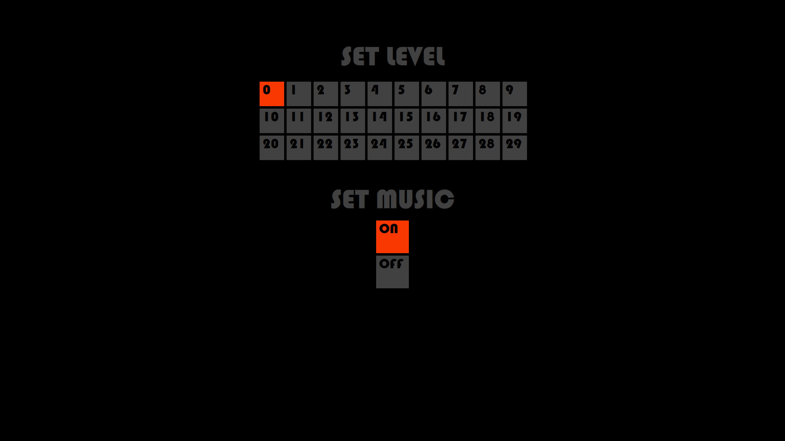
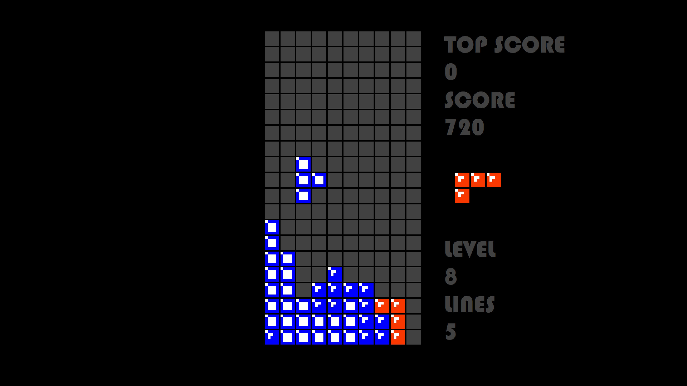
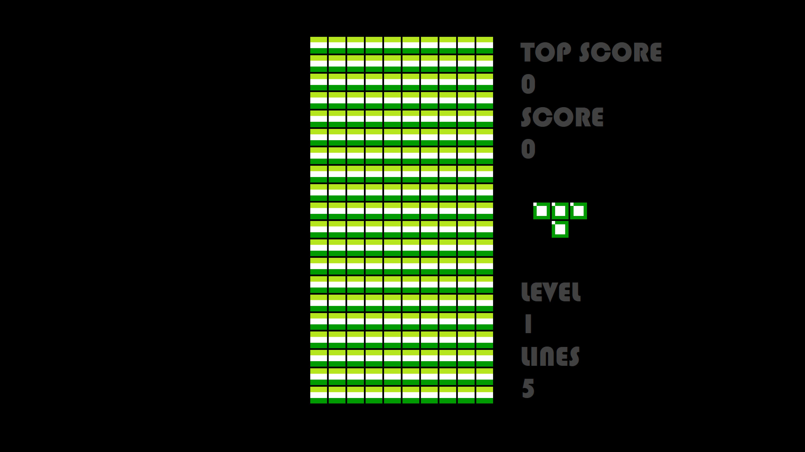
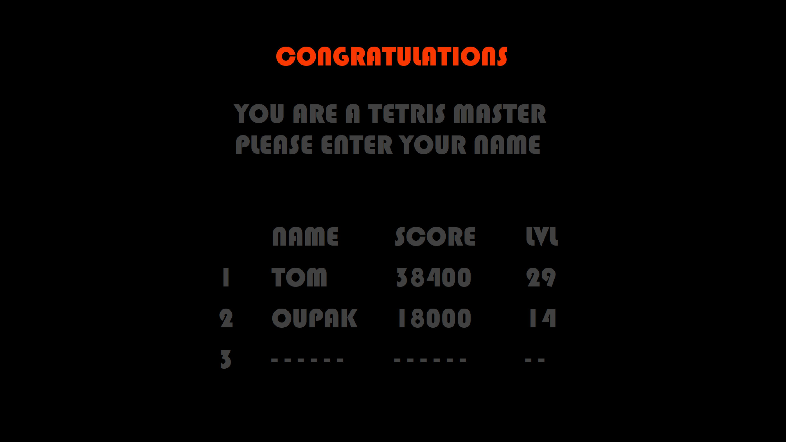

# Tetris

## Aim of the project:
The aim of the project was to practise C# and create fully functional GUI game with music.

## Controls:
X Z ← ↑ ↓ →

## Status of the project:
Functional

## Bugs:
These bugs are occasional. Might not happen at all if a person does not to destroy the application.

- There is a merge of tetrominos when tetromino moves diagonally down. Happens both at slow and fast tetromino movement (↓ pressed).
- Rotation of tetromino out of side and bottom boundaries.

